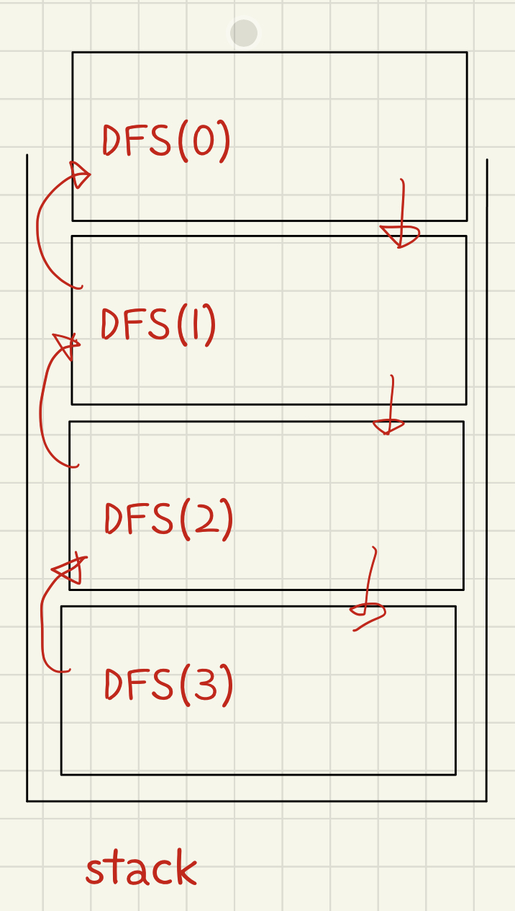

## 목표
- 자연수 N이 입력되면 재귀함수를 이용하여 1부터 N까지를 출력하는 프로그램을 작성하세요.

## 풀이
```javascript
function solution01(n) {
  function DFS(L) {
    if (L === 0) return;
    else {
      console.log('L-1',L);
      DFS(L-1);
      console.log('L-2',L);
    }
  }

  DFS(n)
}

console.log('solution01',solution01(3));
```
- 콘솔 결과값을 보면 L-1은 3,2,1 L-2는 1,2,3 이렇게 찍힌다.
- DFS(3)이 호출되면 쭉 실행되다가 DFS(L-1)을 만나 DFS(L-1)을 실행한다.
- 함수를 호출할 때마다 콜스택에 함수실행컨텍스트가 쌓인다. => L(0)까지 쌓임
- 이렇게 콜스택에 계속해서 쌓이고 L === 0이 되었을 때 함수가 종료되고 쌓여진 콜스택이 위에서 부터 하나씩 실행되고 종료된다.
- L(0)이 종료되면 L(1)을 가르키기 때문에 L(1)스택이 실행된다.
- L(0)이 끝나고 L(1)로 돌아오면 앞 콜스택에 있던 함수를 실행하고 직후인 19번째 "L-2"부분 부터 이어서 함수를 실행하고 종료되고 다음 콜스택을 실행하는방식이다.
- 이런한 방식으로 돌아가기 때문에 L-1은 3,2,1 // L-2는 1,2,3 이렇게 출력된다.
- 쉽게 이해하기 위해선 콜스택과 힙, 실행컨텍스트를 알아보면 좋다!
    




출처
- https://www.inflearn.com/course/%EC%9E%90%EB%B0%94%EC%8A%A4%ED%81%AC%EB%A6%BD%ED%8A%B8-%EC%95%8C%EA%B3%A0%EB%A6%AC%EC%A6%98-%EB%AC%B8%EC%A0%9C%ED%92%80%EC%9D%B4/dashboard
