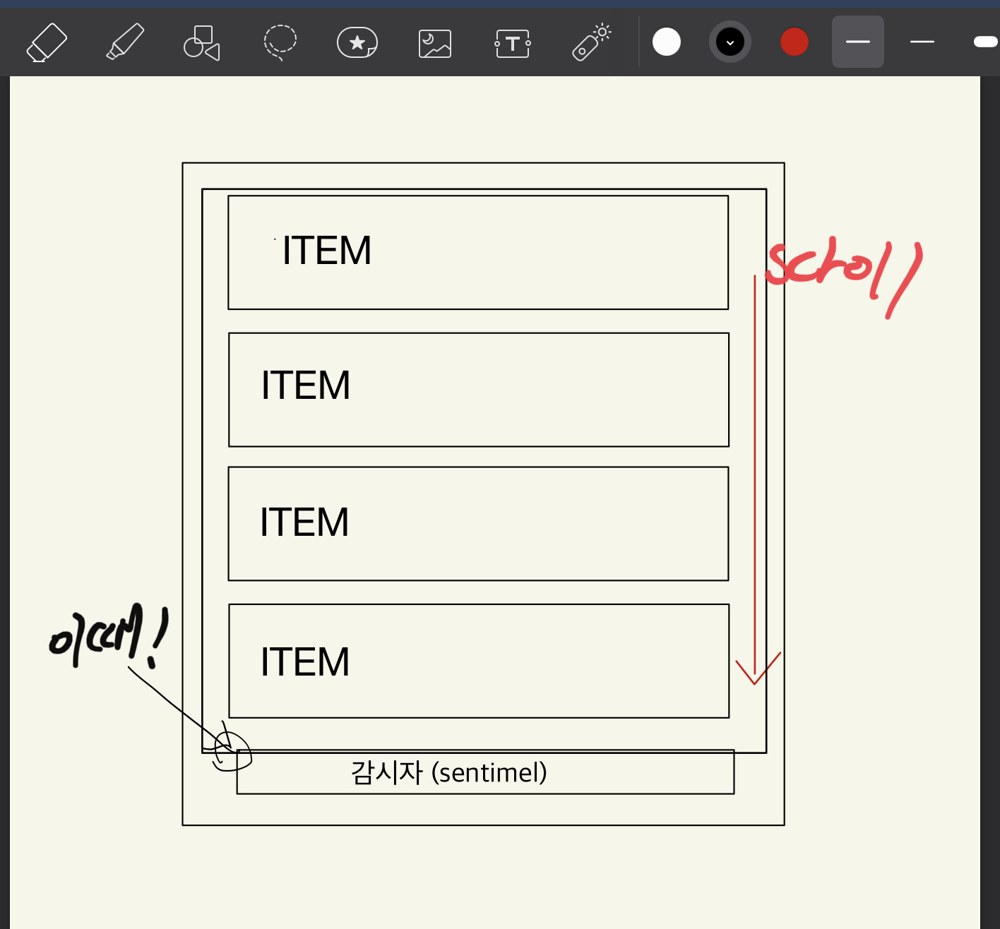

## 무한 스크롤이란

- 말그대로 Inifinite Scroll 이라고 하면 스크롤을 끝까지 내린 경우에 컨텐츠가 추가로 생겨 계속 스크롤을 해야하는 것을 의미한다.
- 사용자가 뭔가를 클릭하지 않아도 컨텐츠를 가져오기 때문에 사용자가 취해야 할 행동을 한 단계 줄여준다.
- 스크롤 하는 행위가 대부분 자연스럽게 받아들여지기 때문에 더욱 직관적이고 쉽다.
- 모바일 환경이나 터치스크린환경에서 더욱 장점이 두드러진다.
- 하지만 만약 사용자가 목적이 있고, 특정 컨텐츠를 찾고있는 상황이라면 페이지네이션을 활용하는것이 더 좋다.

## IntersectionObserver API
```javascript
const io = new IntersectionObserver((entries, observer) => {
  entries.forEach(entey => {
    if (entey.isIntersecting) {
      // 이 부분에 작성
      console.log('observe!')
      
      // 감시종료를 하고 싶으면
      observer.unobserve(entey.target)
    }
  })
});

// 감시 시작
io.observe(Element)

// 감시 종료
io.unobserve(Element);
```

- 우선 IntersectionObserver를 생성 해주고 안에 콜백 함수를 넣어준다.
- 그 후 콜백 함수에 entries를 순환 함수로 처리를 한다.
- 이 때 isIntersecting가 true일때가 화면가 감시대상이 교차된 시점이라고 보면 된다
- 따라서 isIntersecting가 true일때 리스트 맨 밑에 감시할 엘리먼트를 생성하고 그 엘리먼트가 발견되는 순간 추가로 데이터를 불러오면 무한 스크롤이 된다.

## 실제로 사용했던 코드
```javascript
const io = new IntersectionObserver(entries => {
  entries.forEach(entry => {
    if (!entry.isIntersecting) {
      return;
    }

    if (this.places.length > 0) {
      this.morePlaces();
    }
  });
});

io.observe(document.getElementById('sentinel'));
```
- sentimel이라는 이름으로 감시할 엘리먼트를 리스트 제일 아래에 두고
- 감시가 된 순간 더 데이터를 가져오는 함수를 실행했다.
- 맨 처음에는 리스트가 없고 사용자가 동작을 해야 첫 리스트를 불러오는 방식이라서 리스트의 길이가 0보다 클때 추가데이터 가져오는 식으로 설정했다.

## 후기
- 무한스크롤을 구현할때 구현하는데 집중하는것도 좋지만 한걸음 뒤에서 우선 무한스크롤이 필요한지, 페이지네이션이 필요한지 이런한 부분을 생각하는게 더 먼저인 것 같다.
- 기능을 넣는것도 중요하지만 사용자 입장에서 더 좋은 기능을 넣어야하기때문에 그런 부분들에 좀 더 집중을 해야겠다.
- 이러한 기능을 구현해놓고 왜 이 기능을 선택했는지 그런 이유가 없거나 말문이 막힌다면 그런 부분들에 대해서 좀 더 고민을 하자.
