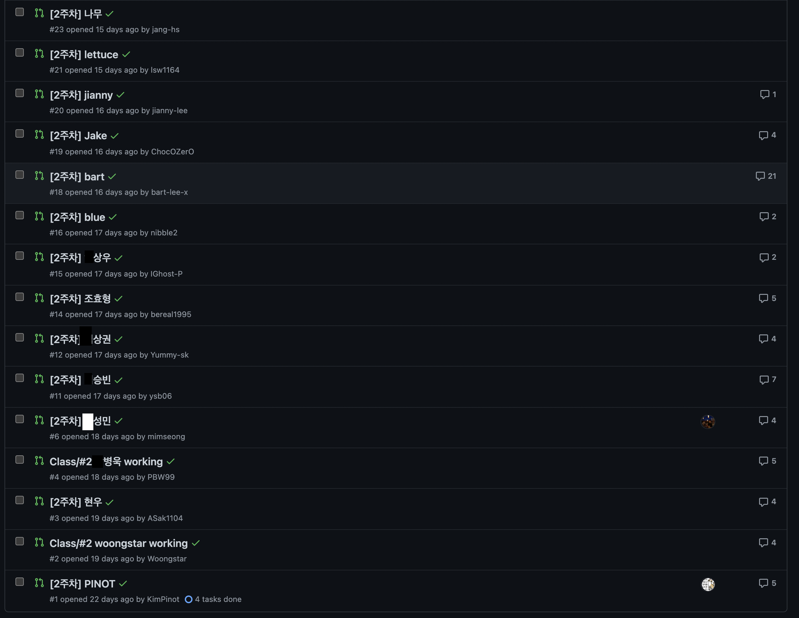

## Event API 만들기
- 앞으로 해야 할 일은 요청이 왔을 때 데이터를 추가/조회/변경/삭제 처리를 하고 결과를 반환하는 API를 만드는 일입니다.
- Ajv 모듈을 활용해서 유효성 검사를 진행한다.

### GET(조회)
- 데이터 불러오기
  - .collection() 으로 firebase에서 데이터를 가져온다.
- 가져온 데이터에서 .get() 메소드를 사용하여 문서 존재여부를 체크하여 처리해준다.

### POST
- 데이터 추가하기
  - collection에서 add메소드로 객체형태로 보내준다.
- 결과 반환 부분을 작성해준다.
```javascript
const returnValue = {
  ...addData,
  id: result.id,
};
res.json(returnValue);
```

### Authentication(인증) & Authorization(인가)
- api를 요청할때는 누구인지 확인하는 작업이 필요하다. (Authentication)
- 인증이 끝나면 확인 후 접근권한을 부여 해준다. (Authorization)
- 프론트엔드에서 인증
  - 구글로그인을 통해 토큰을 가져온다.
  - 토큰이 없다면 구글 로그인을 유도한다.
- 백엔드에서 인증
  - 사용자가 보내준 토큰을 headers에서 authorization을 꺼내와서 유효한지 확인한다.

### PUT
- 메소드에 따라서 분기 처리를 해준다.
- 데이터 필드에서 id와 토큰에 있는 id를 비교해서 다르면 401을 던져 준다.
- 데이터 수정하기
  - update메소드로 기존정보를 가져와서 풀어쓰고 그 위에 수정할 값을 풀어서 덮어준다. {...기존값, ...수정값}
- 결과를 반환 해준다.

## 코드리뷰

- 이렇게 많은 인원에서 코드리뷰하는것은 처음해보았는데 다들 열정이 대단한거 같다.
- 특히 다른사람들 코드를 보고 내가 코드를 짤 때 참고할 때도 있고 여러가지 접근방식에 대해 생각해볼 수 있어서 좋았다.


## 스터디 정보  
[프로그래머스 Node.js 백엔드 개발](https://programmers.co.kr/learn/courses/12547)
