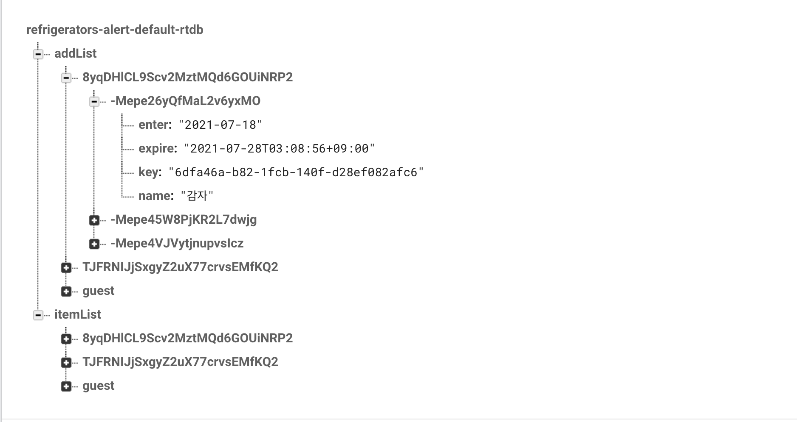
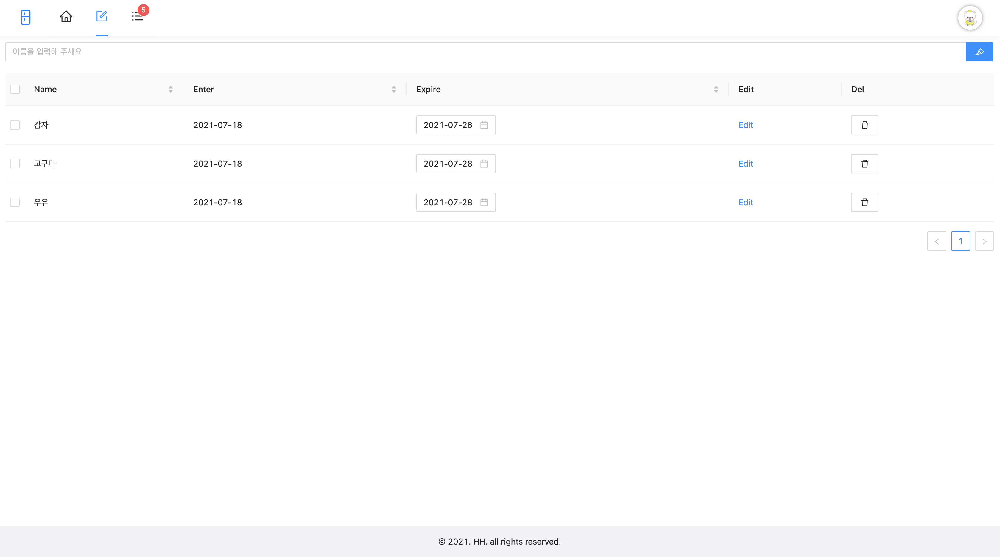
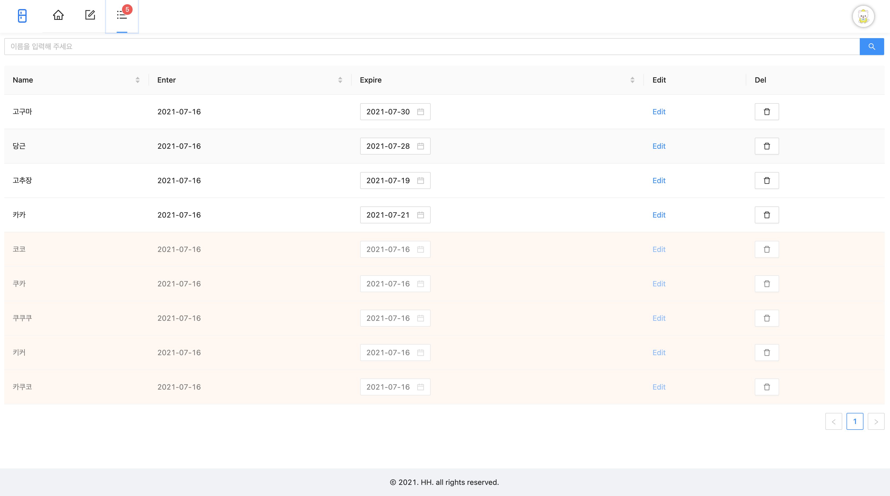

## 프로젝트 구경하기
- [프로젝트 링크](https://github.com/bereal1995/refrigerators-alert)

## 프로젝트 구성안내

### 목표
- 집에서 냉장고 관리가 제대로 되지않아 버리게 되는 음식물들이 많아지고 있다...  
  냉장고 관리를 할 수 있는 웹 어플케이션을 만들어 냉장고 관리를 해보자!

### 기능구현 사항
- 제품 추가 페이지 (냉장고에 추가할 품목리스트)
  - 제품 데이터 추가, 출력, 수정, 제거
  - 각 항목별로 정렬 기능
  - 제품 데이터 리스트 페이지로 이동
  
- 제품 리스트 페이지 (현재 냉장고)
  - 제품 데이터 추가, 출력, 수정, 제거
  - 각 항목별로 정렬 기능
  - 검색 기능

### 간단한 기술스택
- redux-thunk
  - firebase를 통해서 데이터값을 가져오기 위해서는 비동기 작업을 해야하는데  
    이때, 데이터를 스토어에 저장하기 위해 리덕스 미들웨어인 redux-thunk 사용
- dotenv
  - 외부에 노출되면 안되는 환경변수 관리를 위해 설치  
    ex) API_KEY, APP_ID ....
- firebase
  - 사용자가 실시간 연동데이터(realtimeDatabase)를 사용해야함
  - 사용자관리를 위해 firebaseAuth 구글로그인을 사용
  - 배포를 하기 위해 firebase hosting 사용
- react-uuid
  - 냉장고에 품목 데이터를 추가할때 각각 품목을 구분하기 위한 uid를 생성할때 사용
- antd
  - 디자인이 없는 상황에서 안정적이고 완성도있는 UI를 사용하기 위해 선택
  - UI관련 라이브러리중에서 디자인이 맘에 들어 사용
  - 다른 UI라이브러리와 비교해서 비교적 설치방법이 쉬움

## 폴더 트리 구조
```text
├── src
   ├── constants
   │   ├── ConstantsPath.js
   │   └── ContantCss.js
   ├── index.js
   ├── lib
   │   └── firebase.js
   ├── redux
   │   ├── addList
   │   │   ├── addListActions.js
   │   │   └── addListSlice.js
   │   ├── app
   │   │   ├── appActions.js
   │   │   └── appSlice.js
   │   ├── itemList
   │   │   ├── itemListActions.js
   │   │   └── itemListSlice.js
   │   └── store.js
   ├── styles
   │   └── antd-custom.scss
   └── view
       ├── App.js
       ├── components
       ├── containers
       ├── pages
       └── routes
```
- 기본적으로 container에서 props를 가져오고 component로 전달하는식으로 만들었다.
- 서버와 통신하는 부분은 redux-thunk를 통해 state를 업데이트 하는 방식으로 만들었다.

## 데이터 베이스 구조

- 로그인 안된 유저들은 guest를 만들어 그 안에 데이터 값을 넣어주었다.
- 로그인한 유저는 유저 uid로 데이터방을 만들어 그안에 값을 넣어주었다.
- 처음에 제품을 추가하면 add-list로 들어가고 제품 추가를 하게 되면 item-list로 이동시켜주었다.

## 프로젝트 기능설명
냉장고 유통기한 관리하기 위한 웹 어플리케이션 입니다.
### 제품 추가 페이지

- 냉장고 안에 들어있는 제품을 추가하는 페이지 입니다.
- 제품을 추가했을때 기본적으로 현재날짜 와 현재날짜 + 10일로 유통기한이 설정됩니다.
- 체크박스에 체크를 하면 현재 페이지에있는 제품이 리스트페이지로 이동됩니다.
- 유통기한 수정은 Expire부분 캘린더를 통해 수정이 가능합니다
- 제품이름을 변경할 때는 Edit버튼을 통해 수정이 가능합니다.
- Delete버튼을 통해 제품삭제 가능합니다.
### 제품 리스트 페이지

- 현재 냉장고 안에 있는 제품리스트 페이지 입니다.
- 상단 헤더에 배찌에 있는 숫자는 유통기한이 지난 제품에 숫자 입니다.
- 유통기한이 지난 제품들은 색상으로 바로 확인이 가능합니다.
- 유통기한 지난제품도 유통기한날짜 변경이 가능합니다
- Edit, Delete 기능은 제품 추가페이지와 동일합니다.

## 프로젝트 후기
### 수정했던 코드들..
#### 리덕스 관리
```javascript
dispatch(addListActions.listenAddList(user.uid));
dispatch(itemListActions.listenItemList(user.uid));
```
- 같은 기능을 하는 액션을 이름만 다르게 만들어서 아래처럼 하나로 묶었다.

```javascript
dispatch(productActions.listenList(user.uid));
```
- 굳이 불필요하게 2개로 나누었던 액션을 하나로 묶으면서 상태관리가 좀 더 깔끔해 졌다.

#### 구글 로그인
```javascript
auth.setPersistence(firebase.auth.Auth.Persistence.LOCAL)
      .then(() => {
        const provider = new firebase.auth.GoogleAuthProvider();
        auth.onAuthStateChanged((user) => {
          if (user) {
            dispatch(actionsApp.appLogin(user));
          } else {
            auth.signInWithPopup(provider)
          }
        })
      })
      .catch(err => console.log('err',err))
```
- 기존에 session으로 저장했었지만 현재 세션이나 탭에서 유지되다보니 다시 로그인 하는게 불편하여 local에 저장하는 방식으로 수정했다.
#### 리얼타임 데이터베이스
```javascript
const action = {
  create: payload => (dispatch) => {
    // 해당 데이터 위치의 참조에 데이터 추가
    fireDatabase.ref([dataUrl]).push([payload.datas])
  },
  read: userUid => (dispatch) => {
    fireDatabase.ref([dataUrl]).on('value', data => {
      // 데이터 변화가 생기면 전달받은 데이터값으로 액션을 보내 스토어에 저장
      dispatch(actionsProduct.listenProduct(data.val()));
    });
  },
  update: payload => (dispatch) => {
    // 해당 데이터 위치의 참조에 데이터 수정
    fireDatabase.ref([dataUrl]).set([payload.datas]);
  },
  delete: payload => (dispatch) => {
    // 해당 데이터 위치의 참조에 데이터 삭제
    fireDatabase.ref([dataUrl]).remove();
  }
}
```
- 위에 함수들로 CRUD를 구현했다.
- read함수로 데이터 변화를 감지하여 데이터를 최산화 하고
- create, update, delete를 이용하여 데이터를 수정했다.

### antd(앤트디자인)
기존에 bootstrap, material-ui를 사용해보았는데 antd에 디자인이 깔끔하고 이뻐서 사용해봐야지 하고 있다가 이번 프로젝트에 한번 사용해보았다  
내가 느꼈던 장점을 보자면
- 우선 디자인이 깔끔하고 이뻤다.
- 생각보다 검색했을때 레퍼런스가 많아 막히거나 오류가 났을때 비교적 빨리 수정할수있었다.  

아쉬웠던 점으로는
- 사용전에 알아볼때는 다른 프레임워크에 비해 사용하기가 편하다고 했었는데 딱히 그런 느낌은 받지 못했다.

디자인이 마음에 들어서 다음에도 프레임워크를 쓴다면 쓸 의향이 있다.

### redux-thunk
redux-saga를 사용해오다가 redux-thunk를 사용해봤는데  
saga는 여러가지 effect가 있어서 복잡한 느낌이라면  
thunk는 그런게 없어서 좀 더 깔끔하고 쓰기쉬운 느낌을 받았다.
