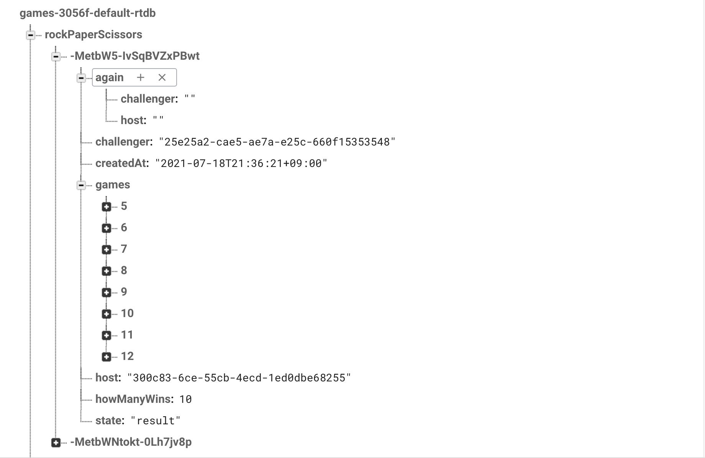
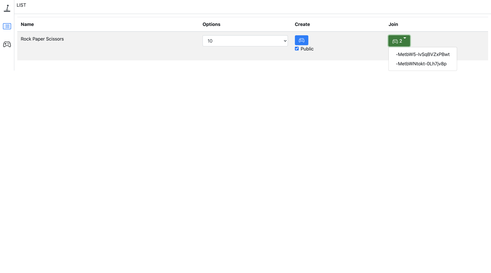
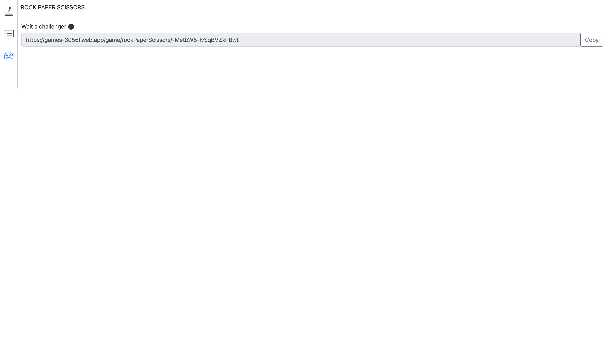
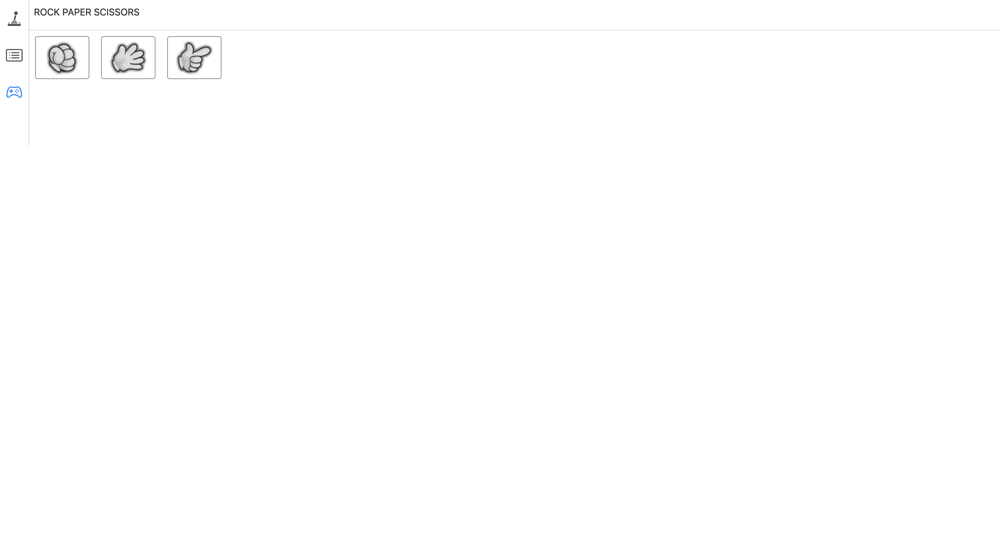
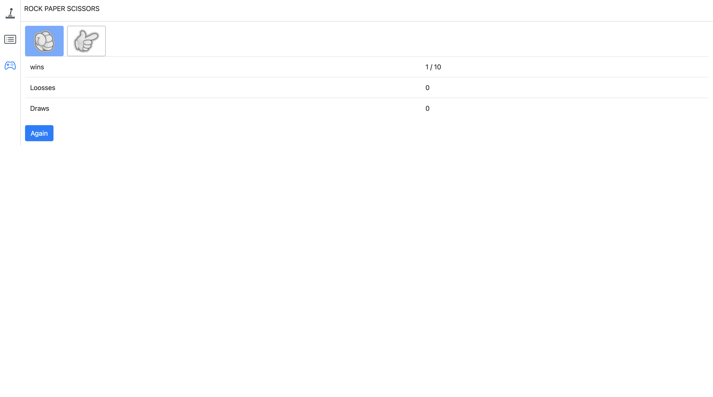
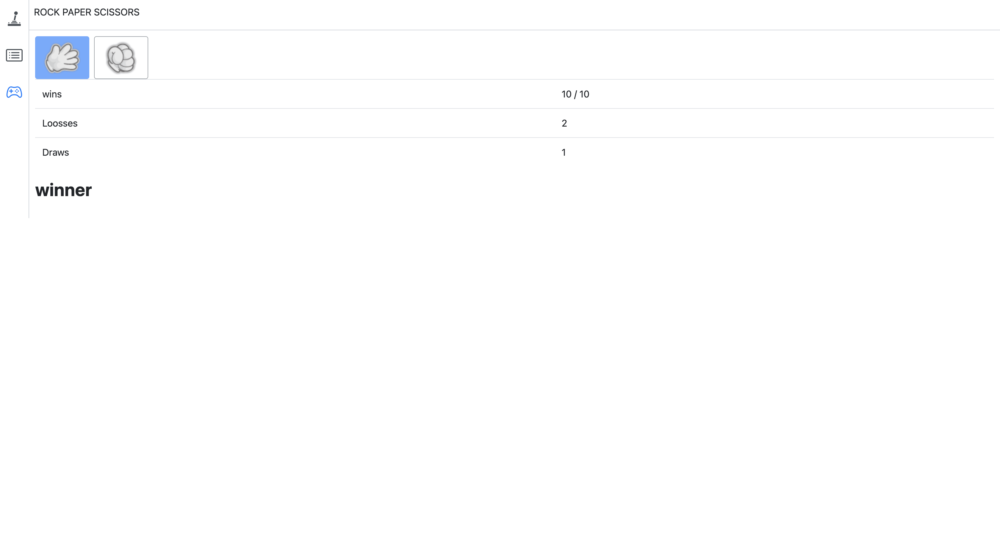

## 프로젝트 구경하기
- [프로젝트 링크](https://github.com/bereal1995/games)

## 프로젝트 구성안내

### 목표
- firebase의 realtimedatabase를 활용하여 1:1 온라인 가위바위보 게임을 만들어보자!

### 기능구현 사항
- 게임 방 생성 페이지
  - 게임 방 만들기
  - 만들어진 방 리스트 가져오기
  - 만들어진 방 클릭 시 게임 플레이로 이동 
  
- 게임 플레이 페이지
  - 상대방이 들어오면 게임 시작 하기
  - 양쪽 다 선택한 값으로 게임 결과 출력
  - 1판이 끝날때마다 다음 게임 넘어가기
  - 모든 판이 끝나면 게임 결과 출력

### 간단한 기술스택
- redux-thunk
  - firebase를 통해서 데이터값을 가져오기 위해서는 비동기 작업을 해야하는데  
    이때, 데이터를 스토어에 저장하기 위해 리덕스 미들웨어인 redux-thunk 사용
- firebase
  - 실시간으로 데이터연동을 통한 온라인 게임플레이를 위해 realtimeDatabase를 사용
  - 배포를 하기 위해 firebase hosting 사용
- bootstrap
  - 디자인이 없는 상황에서 안정적이고 완성도있는 UI를 사용하기 위해 선택
  - UI관련 라이브러리중에서 제일 사용자가 많아 선택 (npmtrend 기준)
- styled-components
  - bootstrap을 사용해도 커스텀해야 되는 부분들이 있었는데 그 부분 수정하기 위해서 선택
- dotenv
  - 외부에 노출되면 안되는 환경변수 관리를 위해 설치  
    ex) API_KEY, APP_ID ....
- react-uuid
  - 게임 방을 만들때 사용자를 구분하기 위해 사용
  - 이 uid값으로 host, challenger 구분을 한다.


## 폴더 트리 구조
```text
├── src
│   ├── images
│   ├── index.js
│   ├── lib
│   │   └── firebase.js
│   ├── redux
│   │   ├── rps
│   │   │   ├── rpsActions.js
│   │   │   └── rpsSlice.js
│   │   └── store.js
│   ├── utlls
│   │   ├── storageutil.js
│   │   └── urlutil.js
│   └── view
│       ├── App.js
│       ├── components
│       │   ├── Common
│       │   ├── NavBar
│       │   └── RockPaperScissors
│       │       ├── GameButton.js
│       │       └── Waiting.js
│       ├── constants
│       │   ├── ConstantsPath.js
│       │   ├── ContantCss.js
│       │   └── ContantGame.js
│       ├── containers
│       │   ├── GameList
│       │   │   └── GameListContainer.js
│       │   ├── NavBar
│       │   │   └── NavBarContainer.js
│       │   └── RockPaperScissors
│       │       ├── PlayContainer.js
│       │       ├── ResultContainer.js
│       │       └── RockPaperScissorsContainer.js
│       ├── pages
│       │   ├── Home.js
│       │   ├── List.js
│       │   ├── NotFound.js
│       │   └── game
│       │       ├── index.js
│       │       └── rockPaperScissors
│       │           └── index.js
│       ├── routes
│       │   └── Routes.js
│       └── style
│           └── GlobalStyle.js
```
- 기본적으로 container에서 props를 가져오고 component로 전달하는식으로 만들었다.
- 서버와 통신하는 부분은 redux-thunk를 통해 state를 업데이트 하는 방식으로 만들었다.

## 데이터 베이스 구조

- challenger, host에는 각각 uuid로 고유 값을 만들어 넣어 주었다.
- games에는 각 게임 결과 값이 들어 있다.
- again은 challenger, host 1판이 끝날때마다 다음판을 진행할지 체크하기 위해 넣었다.
- howmaywins는 몇선승 인지 설정하는 값이다.
- state는 현재 게임 상태로 play, wait, result 이렇게 3가지 값으로 사용했다.

## 프로젝트 기능설명
### 게임방 생성 페이지

- 게임을 시작하기 위해 방을 만들고, 방 목록을 확인할 수 있는 페이지 입니다.
- create버튼을 누르면 게임방을 만들 수 있습니다.
- public을 체크하면 고유한 키값으로 방을 만들어 온라인으로 즐길 수 있습니다.
- Join에 있는 숫자와 리스트는 현재 만들어져있는 방들입니다.
- options의 값만큼 승리하게 되면 게임을 종료하게 돱니다.

### 게임 플레이 페이지

- 아직 상대방이 들어오지 않은 대기중 페이지입니다.
- copy버튼을 눌러 주소를 복사하고 해당 주소로 상대방이 들어오면 게임이 시작됩니다.
- 1개의 디바이스로 게임을 하시는 경우 각 다른 브라우저로 접속하면 이용이 가능합니다.


- 방을 만든 호스트와 도전자가 모두 들어와 게임시작화면 입니다.
- 서로 각각 가위바위보 중에 원하는 값을 눌러 선택합니다.
- 2명 중 한명이라도 선택을 안하면 다음 화면으로 넘어가지 않습니다.


- 1판이 끝날때 마다 나오는 결과 창입니다.
- 게임 결과값들이 테이블로 출력됩니다.
- again버튼을 2명이 모두 누르면 다음판으로 넘어갈 수 있습니다.


- 게임이 모두 끝난 결과 입니다.
- 승자 혹은 패자가 나오고 게임은 끝납니다.

## 프로젝트 후기
### 수정했던 코드들..
```javascript
for (let i = 0; i < games.length; i++) {
  if (getChoice(games[i].host) - getChoice(games[i].challenger) === 0) {
    host.draw += 1;
    challenger.draw += 1;
  } else if (getChoice(games[i].host) - getChoice(games[i].challenger) === 1
    || getChoice(games[i].host) - getChoice(games[i].challenger) === -2
  ) {
    host.win += 1;
    challenger.loose += 1;
  } else {
    host.loose += 1;
    challenger.win += 1;
  }
}
```
- 기존에는 가위, 바위, 보에 각각 숫자값으로 변경해주고 계산하는 식으로 했었다.
- 이렇게 사용하다 보니 시간이 지났을때 코드가 한눈에 들어오지 않아 해석하는데 시간이 너무 오래 걸려 아래와 같이 수정했다.

```javascript
for (let i = 0; i < games.length; i++) {
  if (games[i].host === games[i].challenger) {
    host.draw += 1;
    challenger.draw += 1;
  } else if (games[i].host === 'R' && games[i].challenger === 'S') {
    host.win += 1;
    challenger.loose += 1;
  } else if (games[i].host === 'P' && games[i].challenger === 'R') {
    host.win += 1;
    challenger.loose += 1;
  } else if (games[i].host === 'S' && games[i].challenger === 'P') {
    host.win += 1;
    challenger.loose += 1;
  } else {
    host.loose += 1;
    challenger.win += 1;
  }
}
```
- 무승부와 한쪽이 이길때 경우의 수를 지정해주고 나머지는 반대편이 이기는 식으로 수정했다.
- 이렇게 수정하니 코드가 한눈에 들어와 좀 더 가독성이 좋아졌다.
- 짧은코드로 작성하는것보다는 시간이 지나거나 누가봐도 이해하기 좋은 코드로 짜야 리팩토링 과정에서 좀 더 수월하다는걸 느꼈다.

### 리얼타임데이터 베이스
- 데이터가 실시간으로 연동이 되고 따로 서버를 구축하지 않아도 되니까 너무 좋다.
- 사용해본 결과 안정적이고 속도도 빨랐다.
- 변경사항이 바로바로 알려주니 너무 좋다.
- 사이드프로젝트에서 데이터베이스는 모두 리얼타임데이터베이스로 사용할것 같다.
