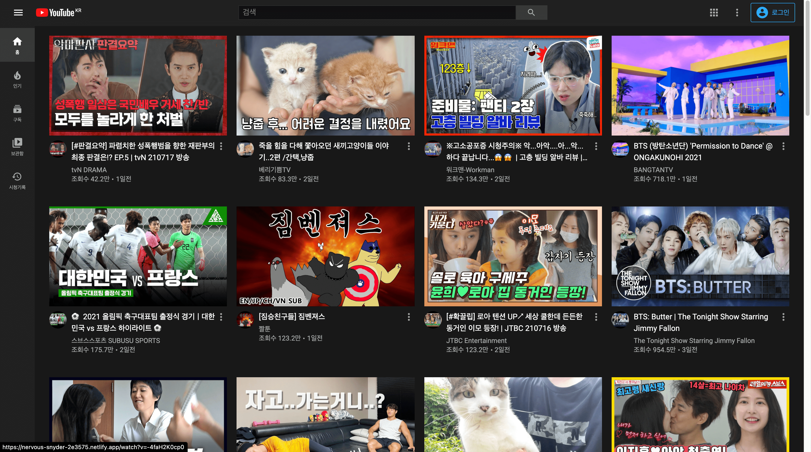
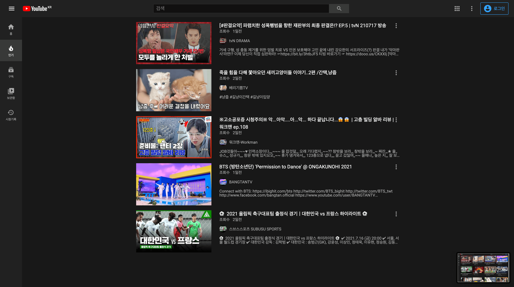
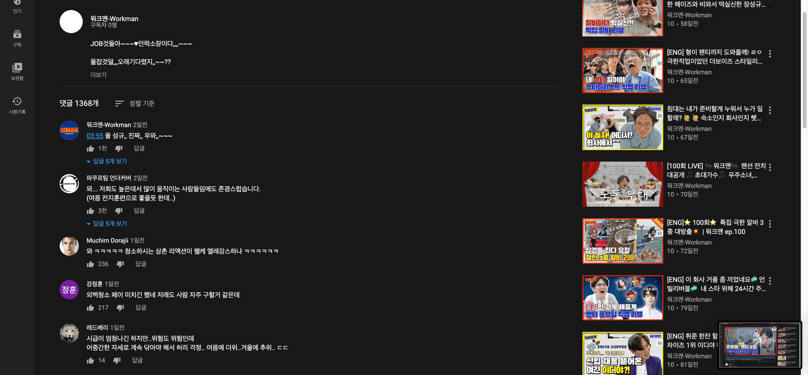
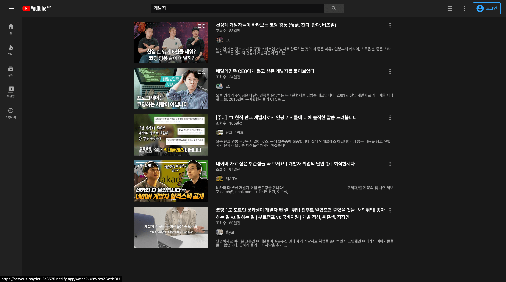
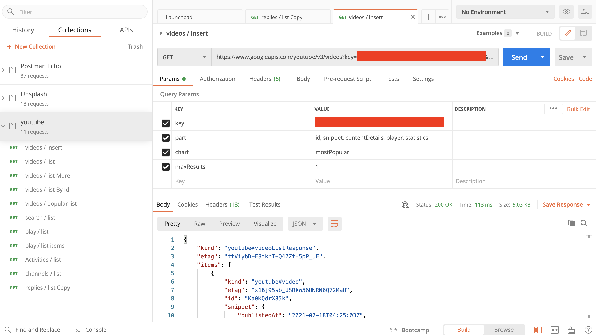

## 프로젝트 구경하기
- [프로젝트 링크](https://github.com/bereal1995/youtube)

## 프로젝트 구성안내

### 목표
- 유튜브API를 활용해서 유튜브 사이트처럼 만들어보자!

### 기능구현 사항
- 메인 페이지
  - 유튜브 영상 데이터 가져오기
  - 가져온 데이터로 화면 출력하기 (인기순위 순으로 데이터 출력)
  - 무한 스크롤 기능
- 인기 페이지
  - 인기 영상 데이터 가져오기
  - 가져온 데이터로 화면 출력 (인기순위 순으로 데이터 출력)
- 검색 페이지
  - 검색어를 활용하여 영상 데이터 가져오기
  - 가져온 데이터로 화면 출력(검색어와 관련된 영상)
- 플레이어 페이지
  - 클릭한 동영상 관련 데이터 가져오기
  - 가져온 데이터로 화면 출력(영상, 댓글, 관련영상 등등)
- 검색 구현
  - 쿼리 파라미터로 검색어 전달

### 간단한 기술 스택
- redux-saga
  - api통신을 할 때 스토어에 데이터를 올려주기 위해 redux미들웨어인 redux-saga사용
  - redux-thunk에 비해 여러가지 기능들이 있다.
  - Generator문법을 사용하는것이 특징이고, 액션을 모니터링하고 있다가 특정 액션이 발생하면 작동한다.
- styled-components
  - 디자인은 기존에 있는 youtube사이트를 보고 만들면 되기때문에 컴포넌트 단위로 스타일을 적용하기 쉽고, props전달도 가능한 styled-components를 선택했다.
- react-google-login
  - 구글로그인을 사용하기 위해 선택했다.
  - useGoogleLogin, useGoogleLogout 등 hook을 가져다 쓰기 쉽게 되어있다.
- dotenv
  - 외부에 노출되면 안되는 환경변수 관리를 위해 설치  
    ex) API_KEY, APP_ID ....
- netlify
  - 깃에 올리기만 하면 자동 빌드 후 배포해준다
  - 따로 환경변수도 설정이 가능하다.
  - 처음에 등록하는법도 간단하고 쉬워서 선택했다.
  
## 폴더트리 구조
```text
.
├── package.json
├── src
│   ├── api
│   ├── constants
│   ├── hooks
│   ├── images
│   ├── index.js
│   ├── lib
│   │   ├── Common.js
│   │   ├── Fetch.js
│   │   ├── History.js
│   │   ├── Hooks.js
│   │   └── Validation.js
│   ├── redux
│   │   ├── ActionCreators.js
│   │   ├── app
│   │   │   ├── redux.js
│   │   │   └── saga.js
│   │   ├── auth
│   │   │   ├── redux.js
│   │   │   └── saga.js
│   │   ├── reducer.js
│   │   ├── saga.js
│   │   ├── search
│   │   │   ├── redux.js
│   │   │   └── saga.js
│   │   ├── store.js
│   │   └── video
│   │       ├── redux.js
│   │       └── saga.js
│   ├── styled
│   │   ├── Common.Styled.js
│   │   ├── Reset.Styled.js
│   │   ├── Responsive.Styled.js
│   │   ├── Util.Styled.js
│   │   └── variable.js
│   └── view
│       ├── App.js
│       ├── Containers
│       │   ├── FeedContainer
│       │   ├── LoadedContainer
│       │   ├── SearchContainer
│       │   ├── VideoListContainer
│       │   └── WatchContainer
│       ├── components
│       │   ├── Button
│       │   ├── Common
│       │   ├── Header
│       │   ├── Icons
│       │   ├── Layout
│       │   ├── Player
│       │   ├── SearchBox
│       │   ├── SideMenu
│       │   ├── Skeleton
│       │   ├── Video
│       │   └── Watch
│       ├── pages
│       │   ├── Feed
│       │   │   ├── Best
│       │   │   ├── History
│       │   │   ├── Library
│       │   │   ├── Subscriptions
│       │   │   └── index.js
│       │   ├── Home
│       │   ├── Results
│       │   ├── Searrch
│       │   ├── Sign
│       │   │   ├── SignIn.js
│       │   │   └── SignUp.js
│       │   └── Watch
│       └── routes
│           └── Routes.js
```
- container에서 props를 가져와서 하위 컴포넌트들에게 필요한 Props를 전달하는 식으로 만들었습니다.

## 프로젝트 기능설명
### 메인페이지

- 메인 페이지 입니다.
- 인기있는 동영상을 youtube API로 가져와서 출력했습니다.
- 보고싶은 동영상을 클릭하시면 동영상 플레이어 페이지로 이동합니다.
- IntersectionObserver를 활용해서 무한스크롤을 구현했습니다.
- 상단 검색바로 동영상 검색 가능합니다.

### 인기동영상 페이지

- 인기 동영상 페이지 입니다.
- 무료 API를 사용중이라 용량제한때문에 5개만 불러오도록 했습니다.
- 보고싶은 동영상을 클릭하시면 동영상 플레이어 페이지로 이동합니다.
- 상단 검색바로 동영상 검색 가능합니다.

### 동영상 플레이어


- 동영상 상제 페이지 입니다.
- 동영상 플레이어, 태그, 영상소개, 관련영상, 댓글, 답글, 좋아요 갯수까지 구현 되어있습니다.
- 보고싶은 동영상을 클릭하시면 해당 동영상 플레이어 페이지로 이동합니다.

### 검색 페이지

- 상단 검색바를 통해 검색을 하면 나오는 검색 페이지입니다.
- 무료 API를 사용중이라 용량제한때문에 5개만 불러오도록 했습니다.
- 보고싶은 동영상을 클릭하시면 해당 동영상 플레이어 페이지로 이동합니다.

## 프로젝트 후기
### netlify
- netlify를 사용했는데 배포가 너무 쉽고,   
- 깃헙에 올라갈때마다 자동으로 빌드 및 배포를 해주니까 너무 좋았다.  
- 빌드 실패했을때도 로그에 문제됐던 부분들이 바로 나와서 해결하기 수월했다.

### youtube api
  
- 워낙 유튜브 api가 종류도 많고 기능도 많아서 전부 사용해보지는 못했다.  
- 아쉬운 점으로는 가끔 문서가 최신화가 안되어있거나 없는 부분이 있어 당황했지만 레퍼런스가 많아서
금방 해결했다.
- 참고 [https://developers.google.com/youtube/v3/getting-started?hl=ko](https://developers.google.com/youtube/v3/getting-started?hl=ko)
  
### IntersectionObserver
```javascript
export const createObserver = (sentinelCurrent, callMoreItems = () => {}) => {
    let observer = new IntersectionObserver((entries, observer) => {
        entries.forEach(entry => {
            if(entry.isIntersecting) {
                callMoreItems && callMoreItems()
            }
        });
    });

    return observer.observe(sentinelCurrent);
}
```
- 무한 스크롤을 구현할때 썼던 함수다
- 레진 기술블로그 글을 보고 구현해봤는데 블로그에 정리가 참 잘되어있다.  
참고 [https://tech.lezhin.com/2017/07/13/intersectionobserver-overview](https://tech.lezhin.com/2017/07/13/intersectionobserver-overview)
