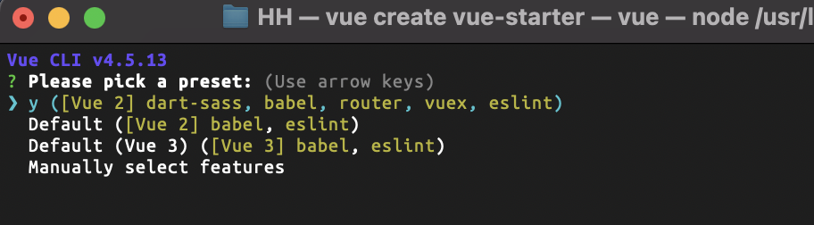

## Vue CLI
```shell
# Vue CLI 설치
npm install -g @vue/cli

# Vue.js 프로젝트 생성
vue create vue-study
```
이러면 이제 옵션을 선택할수가있는데..
나는 아래와 같은 설정으로 셋팅했다.  


## 프로젝트 시작
```shell
# 프로젝트 실행
yarn serve
```
제대로 화면이 잘 나온다면 vue 설치가 완료된것이다.

## 필요 없는 파일 지우기
```diff
- src/components/HelloWorld.vue
- src/views (폴더제거)
```

src/router/index.js
```javascript
import Vue from 'vue'
import VueRouter from 'vue-router'
import Home from '../components/Home.vue'

Vue.use(VueRouter)

const routes = [
  {
    path: '/',
    name: 'Home',
    component: Home
  },
]

const router = new VueRouter({
  mode: 'history',
  base: process.env.BASE_URL,
  routes
})

export default router

```
src/App.vue
```vue
<template>
  <div id="app">
    <Home></Home>
  </div>
</template>

<script>
import Home from './components/Home.vue'

export default {
  components: {
    Home,
  }
}

</script>

```
src/components/Home.vue
```vue
<template>
  <div class="home">
    home
  </div>
</template>
```

나는 매번 불필요한 파일 제거하는게 번거로워  
보통 이정도로 뼈대를 맞춰두고 프로젝트마다 추가해서 사용한다
