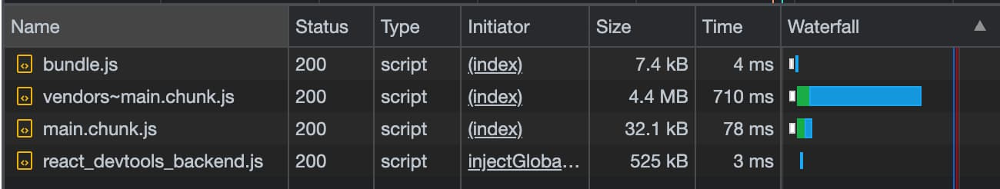
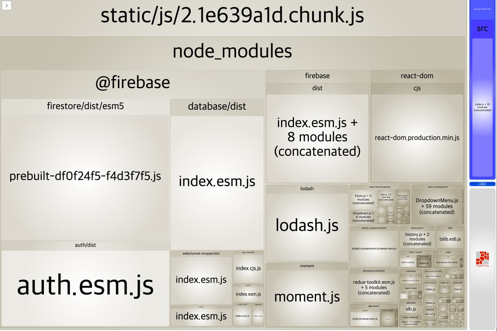
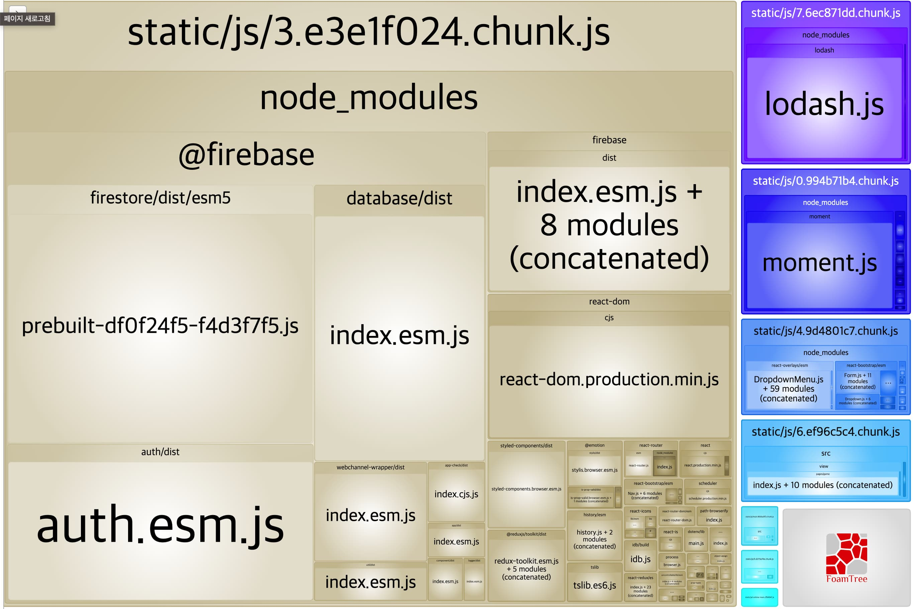
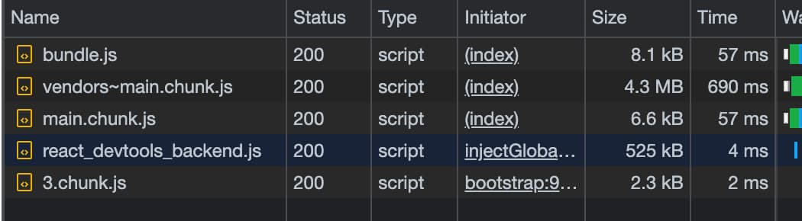

## whyyy



파일용량이 크면 다운로드 시간이 오래걸리고 다운로드가 된 이후부터 코드가 실행되기 때문에 이 시간만큼 화면이 그려지는 시간도 오래걸리게 된다.

그렇다면 용량이 줄이면 좋을텐데 여기에서 xx.chunk.js 파일에 대해 한번 알아보자.

## bundle-analyzer

chunk.js파일이 어떤 파일인지를 확인하기 위해 bundle-analyzer라는 툴을 활용해보자.

현재 프로젝트가 cra기반이기 때문에 cra-bundle-analyzer 사용했다.

```shell
# 설치
## NPM
npm install --save-dev cra-bundle-analyzer
## Yarn
yarn add -D cra-bundle-analyzer

# 실행
npx cra-bundle-analyzer
```



실행하고 나면 이렇게 거대한 js 파일이 나온다

여기서 node_modules에 보면 현재 파일이 로드되는 시점인 첫 페이지 화면에서 사용안하는 라이브러리들이 여러가지 얽혀있다.

메인 페이지에서 로드할때 사용하지 않는 라이브러리는 해당 페이지에서 로드할 수 있도록 CodeSplitting을 해보자.

## Code Splitting

### [Route-based code splitting](https://ko.reactjs.org/docs/code-splitting.html#route-based-code-splitting)

> React.lazy를 [React Router](https://reacttraining.com/react-router/) 라이브러리를 사용해서 애플리케이션에 route기반 코드 분할을 설정할 수 있다.
> 추가로, CRA가 아닌 상황에서 사용하는경우에는 [webpack설정](https://webpack.js.org/guides/code-splitting/)을 따로 해줘야 한다.

```jsx
import React, { Suspense, lazy } from 'react';
import { Route, Switch } from 'react-router-dom';
import NotFound from '../pages/NotFound';
import { PATH_GAME, PATH_HOME, PATH_LIST } from '../constants/ConstantsPath';

const Home = lazy(() => import('../pages/Home'));
const List = lazy(() => import('../pages/List'));
const Game = lazy(() => import('../pages/game'));

function Routes() {
  return (
    <Contents>
      <Switch>
        <Suspense fallback={<div>Loading...</div>}>
          <Route exact path={PATH_HOME} component={Home} />
          <Route path={PATH_LIST} component={List} />
          <Route path={PATH_GAME} component={Game} />
        </Suspense>
        <Route component={NotFound} />
      </Switch>
    </Contents>
  );
}
```

## 결과





- 이전과 비교했을때 xx.chunk.js 파일이 여러개로 쪼개져있다.
- 처음 로드했을때 xx.chunk.js 파일 사이즈가 작아졌으며 실제로 로드시간도 빨라졌다.
- 다른 페이지로 이동할때 분할된 xx.chunk.js파일을 로드하는것을 Network탭에서 확인했다.

참고

- [https://www.npmjs.com/package/cra-bundle-analyzer](https://www.npmjs.com/package/cra-bundle-analyzer)
- [https://ko.reactjs.org/docs/code-splitting.html#route-based-code-splitting](https://ko.reactjs.org/docs/code-splitting.html#route-based-code-splitting)
- [https://webpack.js.org/guides/code-splitting/](https://webpack.js.org/guides/code-splitting/)
- [https://www.inflearn.com/course/웹-성능-최적화-리액트-1/](https://www.inflearn.com/course/%EC%9B%B9-%EC%84%B1%EB%8A%A5-%EC%B5%9C%EC%A0%81%ED%99%94-%EB%A6%AC%EC%95%A1%ED%8A%B8-1/)
