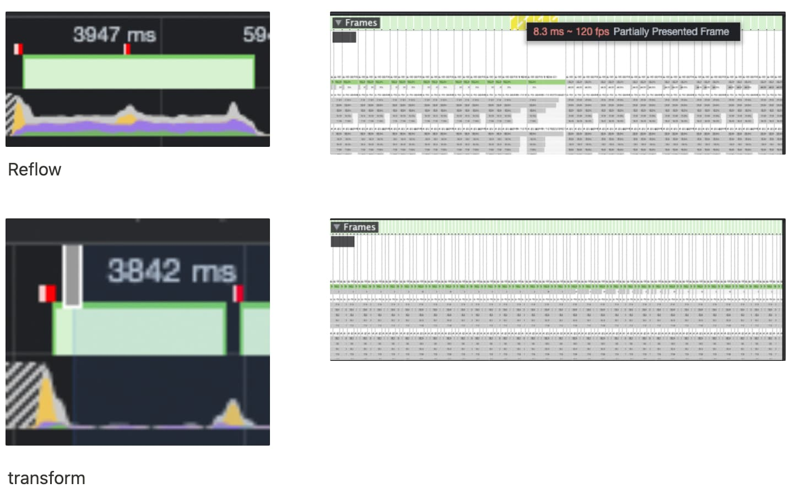

## 애니메이션 원리

- 여러개의 이미지가 빠르게 움직이는 것
- 중간에 frame이 하나 빠지면 끊기는 느낌이 든다.
- 일반 디스플레이 => 초당 60frame
- 브라우저 => 초당 60frame (여기서! 60Frame을 제대로 못그릴때 <b>쟁크현상</b>이 발생!)

## 브라우저 렌더링 과정 (간략히)

1. DOM + CSSOM
2. Render Tree(DOM, CSSOM을 조합)
3. Layout(위치, 크기 계산)
4. Paint(색 채우기)
5. Composite(각 레이어 합성)

만약 스타일이 살짝 변화가 생긴다면 1번부터 5번까지 다시 순서대로 실행된다.

애니메이션은 초당 60Frame이 나와야 하는데 저 짧은 시간동안 1~5번을 거쳐야하는데 브라우저 입장에서는 무리가 가서 중간중간 생략하게 되는 경우가 생길 수 있다

## Reflow

> 모두 재실행

1. DOM + CSSOM
2. Render Tree(DOM, CSSOM을 조합)
3. Layout(위치, 크기 계산)
4. Paint(색 채우기)
5. Composite(각 레이어 합성)

## Repaint

> Layout부분은 생략

1. DOM + CSSOM
2. Render Tree(DOM, CSSOM을 조합)
3. ~~Layout(위치, 크기 계산)~~ **생략**
4. Paint(색 채우기)
5. Composite(각 레이어 합성)

## Reflow, Repaint 피하기 (GPU 도움받기)

> tranform, opacity(GPU가 관여할 수 있는 속성)을 변경

1. DOM + CSSOM
2. Render Tree(DOM, CSSOM을 조합)
3. ~~Layout(위치, 크기 계산)~~ **생략**
4. ~~Paint(색 채우기)~~ **생략**
5. Composite(각 레이어 합성)

## 스타일 속성별 속도

- Reflow 발생하는 스타일 속성(크기, 위치 등을 변경) ⇒ 느림
- Repaint 발생하는 스타일 속성(색상을 변경) ⇒ 보통
- Reflow, Repaint 생략하는 속성(GPU를 사용) ⇒ 빠름
- [CSS속성별 참고](https://docs.google.com/spreadsheets/u/0/d/1Hvi0nu2wG3oQ51XRHtMv-A_ZlidnwUYwgQsPQUg1R2s/pub?single=true&gid=0&output=html)

## 결과

스크린샷을 비교해보면 위: Reflow 아래: transform을 사용한 결과이다. (CPU: 6x slowdown 적용)

- Frame같은 경우는 거의 차이가 없지만 디테일하게 확인을 해보면 Reflow에 경우 일정 부분에서 Partially Presented Frame 이라는 경고를 통해 메인 스레드에 부담이 가는것을 확인할 수 있다.
- Frame 하단에 색칠된 부분을 보면 Reflow는 메인 스레드에 부담이 많이가는것이 보이고 transform은 GPU에 도움을 받아 렌더링 하기 때문에 메인쓰레드에서 하는일이 거의 없다.

## 참고 자료

- https://docs.google.com/spreadsheets/u/0/d/1Hvi0nu2wG3oQ51XRHtMv-A_ZlidnwUYwgQsPQUg1R2s/pub?single=true&gid=0&output=html
- https://wit.nts-corp.com/2017/06/05/4571
- https://code-anthropoid.tistory.com/277
- https://developer.mozilla.org/ko/docs/Web/CSS/will-change
