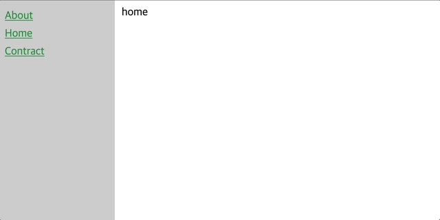

import { getImage, GatsbyImage } from 'gatsby-plugin-image';

## index.html 설정

```html play
<nav>
  <ul class="navbar-list">
    <li class="navbar-item"><a href="#" data-route="/about">About</a></li>
    <li class="navbar-item"><a href="#" data-route="/">Home</a></li>
    <li class="navbar-item"><a href="#" data-route="/contract">Contract</a></li>
  </ul>
</nav>
```

- 라우팅을 하기 위한 네비게이션을 넣어준다.
- data-route에 경로를 설정해준다.

## router.js 설정

```javascript
import home from './pages/home.js'
import contract from './pages/contract.js'
import about from './pages/about.js'

const routes = {
  '/': home,
  '/contract': contract,
  '/about': about,
}

const initialRoutes = el => {
  window.onpopstate = () => renderHTML(el, routes[window.location.pathname])
}

const onNavigate = (pathname, el) => {
  window.history.pushState({}, pathname, window.location.origin + pathname)
  renderHTML(el, routes[pathname])
}

const renderHTML = (el, route) => {
  el.innerHTML = route
}

export { routes, onNavigate, initialRoutes }
```

- routes 객체를 만들고 경로값에 따라 컴포넌트를 설정해준다.
- history.pushState를 사용하는 이유는 페이지를 reload하지않고 url을 변경하기 위해 사용했다.
- onpopstate는 브라우저에서 앞/뒤로가기 할때 발생하는 이벤트이다.

### popstate

- popstate(state, title, url)식으로 사용한다.
- state => 상태 객체로 popstate이벤트가 발생하면 이벤트 객체에 state 속성에 복제본이 담겨있다.
- title => 지금은 대부분 브라우저가 무시하는 부분이지만, [먼 미래에는 쓰일수도 있다고 한다.](https://github.com/whatwg/html/issues/2174)
- url => `popstate`를 사용하는 이유다. pushState 호출 이후에 브라우저는 주어진 URL로 탐색하지 않는다.
  즉, url이 변해도 그 url를 탐색하지 않는다. !url의 출처는 동일해야한다.

## app.js 설정

```javascript
import { routes, onNavigate, initialRoutes } from './router'

const rootDiv = document.getElementById('root')
const nav = document.querySelector('nav')

rootDiv.innerHTML = routes[window.location.pathname]

window.onload = () => {
  initialRoutes(rootDiv)
  nav.addEventListener('click', e => {
    e.preventDefault()
    const pathname = e.target.getAttribute('data-route')
    onNavigate(pathname, rootDiv)
  })
}
```

- index.html에서 만든 네비게이션에 이벤트 위임을 통해 각각 링크들한테 click이벤트를 걸어준다.

## 결과물




## 참고자료

- https://developer.mozilla.org/ko/docs/Web/API/History/pushState
- https://developer.mozilla.org/ko/docs/Web/API/Window/popstate_event
